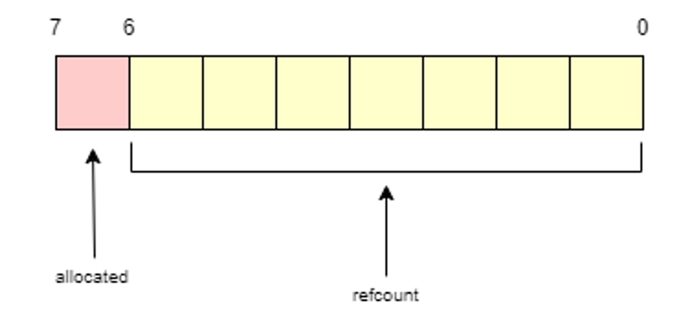
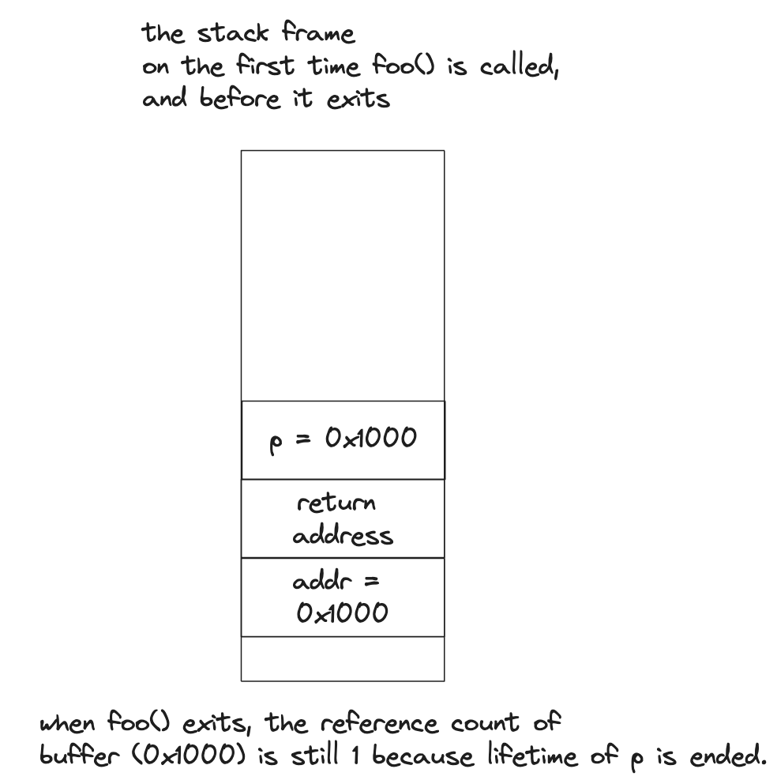
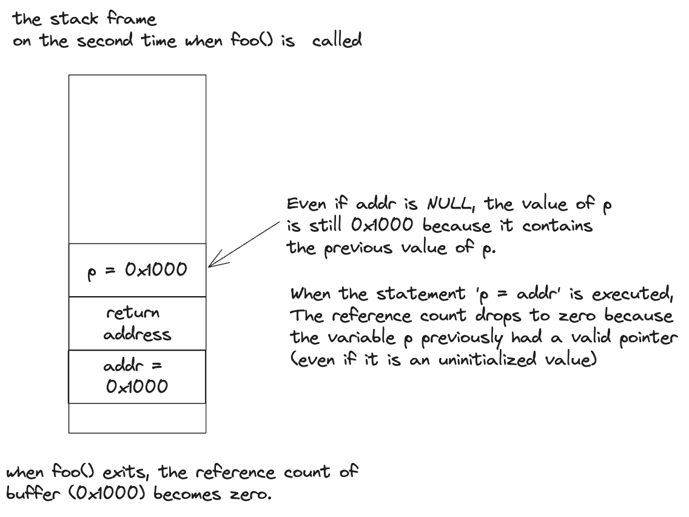

# Pseudocode for PreciseLeakSanitizer

This document specifies pseudocode for the implementation of PreciseLeakSanitizer. It is a memory leak detector that can find memory leaks at runtime similar to [the leak sanitizer in LLVM and GCC](https://github.com/google/sanitizers/wiki/AddressSanitizerLeakSanitizer). It is designed to pinpoint where the process lost its last reference efficiently.

## Table of Contents
1. [LSan's ChunkMetadata](#1-lsan's-chunkmetadata)
2. [Reference Count Encoding](#2-reference-count-encoding)   
	- 2.1 [Initializing reference count](#21-initializing-reference-count)   
3. [Tracking reference count of a buffer](#4-tracking-reference-count-of-a-buffer)  
	- 3.1 [When reference count is incremented](#41-when-reference-count-is-incremented)  
	- 3.2 [When reference count is decremented](#42-when-reference-count-is-decremented)  
	- 3.3 [More considerations and optimizations](#33-more-considerations-and-optimizations)  
        - 3.3.1 [When a function exits](#331-when-a-function-exits)  
        - 3.3.2 [Freed pointer variables either on heap or on stack should be initialized to NULL](#332-freed-pointer-variables-either-on-the-heap-or-on-the-stack-should-be-initialized-to-null)  
        - 3.3.3 [Not instrumenting when storing to stack variables](#333-not-instrumenting-when-storing-to-stack-variables)    
4. [Report a memory leak](#4-reporting-a-memory-leak)
    - [4.2 Storing stack backtrace when memory is allocated](#41-storing-stack-backtrace-when-memory-is-allocated)

## 1. LSan's ChunkMetadata
To store Reference Count, understanding LSan's `ChunkMetadata` structure is very important. 

LSan uses `ChunkMetadata` structure when it allocate some dynamic memory. See the LSan’s implementation, Interceptors are change standard C library funtions(e.g. malloc, realloc, valloc, calloc, … etc) to LSan's customized function. This is `ChunkMetadata` structure code below:

```C++
struct ChunkMetadata {
  u8 allocated : 8;  // Must be first.
  ChunkTag tag : 2;
#if SANITIZER_WORDSIZE == 64
  uptr requested_size : 54;
#else
  uptr requested_size : 32;
  uptr padding : 22;
#endif
  u32 stack_trace_id;
};
```

but LSan only use `allocated` field's 1 bit. because it is just indentifier to check each chunk is allocated, it has two states, `1` (allocated) and `0` (deallocated). So we decided to store reference count value on wasted 7-bits.

However, Generally LSan's Metadata is not able to be accessed by external. To solve this problem,  LSan have to run above PreciseLeakSanitizer’s allocator.

## 2. Reference Count Encoding
In previous section, ways to utilize ChunkMetadata structure already explained as simple. the picture is simpified diagram to shows our goal.



`allocated`, Previously occupying 8-bits, is split into two : 1-bit and 7-bit. `allocated` will use MSB(Most Significant Bit), our goal, `refcount` will access least 7-bit.

The reason that storing refcount into least 7-bit is for convenience when increment/decrement calcuation. Additionally when returns allocated bit simpily is able to process from Bitwise operation, so we choose this selection.

### 2.1 Initializing reference count
Let’s see the LSan’s Code Snippets again. Next code is part of LSan’s Allocator code.

```C++
static void RegisterAllocation(const StackTrace &stack, void *p, uptr size) {
  if (!p) return;
  ChunkMetadata *m = Metadata(p);
  CHECK(m);
  m->tag = DisabledInThisThread() ? kIgnored : kDirectlyLeaked;
  m->stack_trace_id = StackDepotPut(stack);
  m->requested_size = size;
  atomic_store(reinterpret_cast<atomic_uint8_t *>(m), 1, memory_order_relaxed);
  RunMallocHooks(p, size);
}

static void RegisterDeallocation(void *p) {
  if (!p) return;
  ChunkMetadata *m = Metadata(p);
  CHECK(m);
  RunFreeHooks(p);
  atomic_store(reinterpret_cast<atomic_uint8_t *>(m), 0, memory_order_relaxed);
}
```

Functions that `RegisterAllocation` and `RegisterDeallocation` are related to allocation and deallocation. See each function’s last line, stores `1` or `0` value into `ChunkMetadata` structure’s `allocated` field from `atomic_store` function.

PreciseLeakSanitizer modify this, if the buffer is deallocation state, it will save `128` (`0b10000000`) and otherside store `127` (`0b10000001`) because to add refcount when allocation is executed. because it is a unsigned type. 

After this, PreciseLeakSanitizer will manage refcount same as solution that next section.

## 3. Tracking reference count of a buffer

As explained in [2.1 Initializing reference count](#21-initializing-reference-count) section, the reference count is initialized when allocating memory. Reference count is incremented or decremented, but when it reaches zero, generally it is a memory leak. But there are few exceptions on this. Read [section 4.3.1](#431-when-a-function-exits) for more details.

### 3.1 When reference count is incremented
Reference count is incremented when:

1. Storing the value of a pointer to another variable.
2. Copying memory to memory using memcpy(), memmove() or etc.

### 3.2 When reference count is decremented
Reference count is decremented when:

1. Overwriting a pointer variable with another value.
2. When memory is overwritten by memcpy(), memset(), memmove() etc.
3. **When freeing an object** that refers to other objects. In this case, of course, you need to search pointers inside the object every time one of free(), delete or delete[] is called.
4. **When a function exits**, its local variables are automatically freed. so you need to decrement the reference count of buffers that local variables point to.

### 3.3 More considerations and optimizations

#### 3.3.1 When a function exits

As stated in [section 4.2](#42-when-reference-count-is-decremented), local variables are automatically freed at function exit and thus the reference count of buffers referenced by local pointer variables should be decremented.

However, even if the reference count becomes zero, it might not be a memory leak if the pointer is the return value of a function. In that case, it is possible that the pointer value is written back to memory.

Let's consider the following code:

```c
void *malloc_wrapper(size_t size)
{
    void *ptr = malloc(size);
    return ptr;
}

void foo()
{
    void *foo = malloc_wrapper(10);
    [...]
}
```

When malloc_wrapper() exits, the reference count of the buffer becomes zero because the lifetime of ptr ends when the function exits. But in foo(), the pointer value is written back to memory. So if reference count becomes zero because of local variable's lifetime is ended, it might not be a memory leak.

Similarly, the return value of malloc() might never be written to memory. In both cases, we need to check if the return value is written to memory after the function exits.

```c
void foo()
{
    malloc(10);
    [...]
}
```

The solution for both situation is to check if the pointer is written to memory after a function call, or the pointer value is return value of current function (the caller of malloc(), for example)

#### The solution to this problem

If the returned pointer is utilized by StoreInst or ReturnInst, a call to **checkReturnedOrStoredValue()** function is inserted.

To achieve this, the LLVM pass must traverse all users that utilize the return value of a CallInst (and check if is StoreInst or ReturnInst). It is assumed that **StoreInst that utilizes return value of a CallInst must be within the same BasicBlock.** Also, **if the return value is returned without StoreInst, it is assumed that the ReturnInst must be within the same Basic Block.** Therefore it is enough to traverse users only within the BasicBlock of the CallInst.

```c
// Checks if correct pointer value is stored or returned
void checkReturnedOrStoredValue(void *RetPtrAddr, void *ComparePtrAddr) {
    uint8_t RetRefCnt = GetRefCount(RetPtrAddr);
    uint8_t CompareRefCnt = GetRefCount(ComparePtrAddr);

    if (RetRefAddr <= 0) {
        return;
    } else if (RetRefCnt != CompareRefCnt) {
        Error();
    }
}
```

If the pointer value returned by the CallInst is not utilized by StoreInst nor ReturnInst within the same BasicBlock, it is obviously a memory leak. In that case, reportMemoryLeak() function should be called.

```c
/*
    A call to this function is inserted after a CallInst if the pointer
    returned by the CallInst is not utilized. It can be possible
    that the pointer does not reference heap space, so need to check
    that first.

    If 1) it references heap and 2) the reference count is zero, it is
    obviously a memory leak.
*/
void reportMemoryLeak(void *RetPtrAddr) {
    uint8_t RetRefCnt = GetRefCount(RetPtrAddr);
    /* RetPtrAddr reference heap space and the reference count is zero */
    if (RetRefCnt == 127) {
        Error();
    }
}
```

Again, reportMemoryLeak() is inserted after CallInst **when the function's return type is pointer AND there's no StoreInst or ReturnInst utilizes the return value.** It can be possible that the return pointer does not refer heap address space, so need to check that first. In the future this can be optimized further, but this is the current approach so far.

#### Pseudocode

Pseudocode when a function exits (at runtime):  
**This routine should be inserted to _every_ ReturnInst of a function**

```c
decrement reference counts of buffers that local variables reference
if any buffer's reference count drop to zero:
  if the buffer's address is the return value of current function:
    do nothing, just return
  else:
    report a memory leak with the information on the local variable
else:
  do nothing, just return

```
Pseudocode when calling a function (in the LLVM pass)  
**For any CallInst**:

```c
if the function's return type is a pointer:
  traverse all users of the return value, in the BasicBlock of the CallInst
  if there is any StoreInst or ReturnInst in the users:
    insert a CallInst to checkReturnedOrStoredValue() before the user
  else:
    insert a CallInst to reportMemoryLeak() after the CallInst
```

#### 3.3.2 Freed pointer variables (either on the heap or on the stack) should be initialized to NULL

If any pointer variable is freed (either a variable on the stack or on the heap), it must be initialized to NULL. This is because the PreciseLeakDetector can malfunction when it stores data to an uninitialized variable.

Let's look at an example:

```c
void foo(void *addr)
{
  void *p =  addr;
}

int main(void)
{
  void *ptr = malloc(10);

  foo(ptr);
  foo(NULL);
}
```

<p align="center">

</p>

Just before calling foo() in main(), the reference count of the buffer is 1. After calling foo() the first time, the reference count should still be 1 when foo() exits.

<p align="center">

</p>

But on the second time foo() is called, the reference count might become zero because the uninitialized value of p is still a valid pointer. That's why every pointer variable needs to be initialized to zero when it's freed.

This applies to heap objects in the same manner. Basically when free() is called, PLSAN must scan the freed object to find valid pointers within the freed object, and then it decrements reference counts of buffers referenced by such pointers as explained in the [section 4.2](#42-when-reference-count-is-decremented). After decrementing a reference count, the pointer should be set to NULL for the same reason as pointer variables on the stack.

#### 3.3.3 Not instrumenting when storing to stack variables
I believe it is possible to avoid instrumenting StoreInsts for local variables, but need to think more about it.

### 4. Reporting a memory leak

Let's look at what the report by PLSAN would look like. Below is an example program with a memory leak:

```c
   1   │ #include <stdlib.h>
   2   │
   3   │ int main(void)
   4   │ {
   5   │   void *ptr = malloc(10);
   6   │
   7   │   ptr = NULL;
   8   │
   9   │   return 0;
  10   │ }
```

The report will look like this:

```bash
=================================================================
==<Process Number>==ERROR: PreciseLeakSanitizer: detected memory leaks

Leak of 10 byte(s) in an object (<address of the object>) allocated from:
    #1 0x401137 in main /home/hyeyoo/precise-leak-sanitizer/main.c:5
    #2 0x7fd7dd83feaf in __libc_start_call_main (/lib64/libc.so.6+0x3feaf)

Last reference to the object (<address of the object>) lost at:
    #1 0x401150 in main /home/hyeyoo/precise-leak-sanitizer/main.c:7
    #2 0x7fd7dd83feaf in __libc_start_call_main (/lib64/libc.so.6+0x3feaf)
```

It shows 1) **where the object is allocated** and 2) **where the last reference to it is lost.** To show where it is allocated, PLSAN should store stack backtrace when a memory allocation function is called. Printing stack backtrace when the last reference to the object is lost is done by printing it immediately.

## 4.1 Storing stack backtrace when memory is allocated

It is worth noting that **deduplication matters** when the number of allocated memory blocks is huge. de-duplication generally means avoiding duplication of data. For PLSAN, it means not storing the same stack backtrace more than once. It matters for PLSAN because it is extremely common to allocate objects several times, in the same call path.

KASAN (Kernel ASAN) has similar deduplication mechanism called [stackdepot](https://elixir.bootlin.com/linux/v6.8-rc1/source/lib/stackdepot.c) and I (the author, Hyeonggon) am pretty sure ASAN has similar deduplication mechanism. It would be unnecessary to implement our own deduplication mechanism if we implement PLSAN as a [static plugin](https://github.com/banach-space/llvm-tutor?tab=readme-ov-file#dynamic-vs-static-plugins) because we may utilize what's already in LLVM, but before we start porting PLSAN to LLVM we need our own implementation.

One idea for deduplication is to have to two maps (either hashmap or treemap): one that converts 1) object address to a unique ID (possibly hash value of stack backtrace), and the other that converts the unique ID to actual stack backtrace.