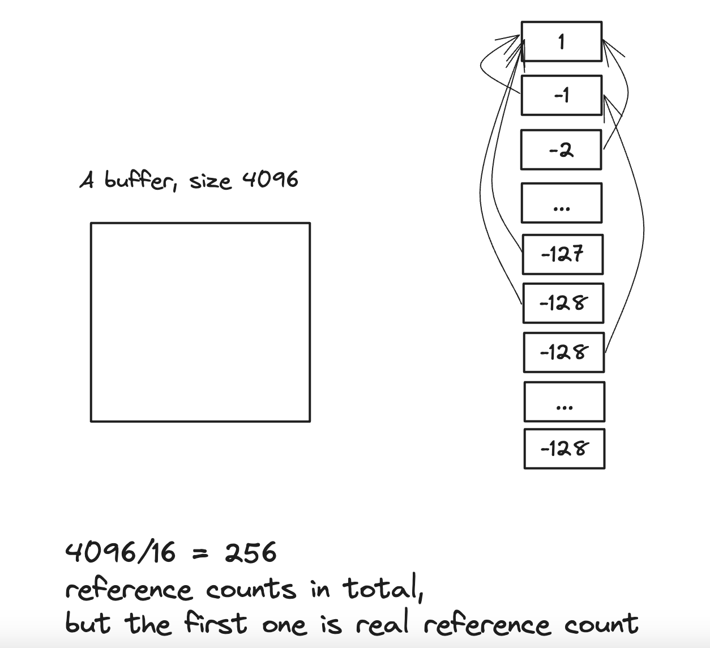
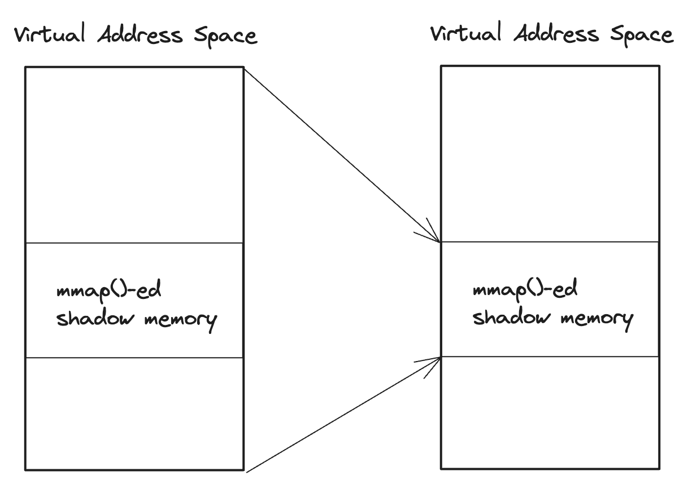

# Pseudocode for PreciseLeakSanitizer

This document specifies pseudocode for the implementation of PreciseLeakSanitizer. It is a memory leak detector that can find memory leaks at runtime similar to [the leak sanitizer in LLVM and GCC](https://github.com/google/sanitizers/wiki/AddressSanitizerLeakSanitizer). It is designed to pinpoint where the process lost its last reference efficiently.

## Table of Contents
1. [Minimum alignment for allocation](#minimum-alignment-for-allocation)
2. [Reference Count Encoding](#reference-count-encoding)   
	2.1 [Initializing reference count](#initializing-reference-count)  
	2.2 [Converting a virtual address to reference count](#converting-a-virtual-address-to-reference-count)  
3. [mmap()ing Reference Counting Address Space](#mmaping-reference-counting-address-space)
4. [Tracking reference count of a buffer](#tracking-reference-count-of-a-buffer)  
	4.1 [When reference count is incremented](#when-reference-count-is-incremented)  
	4.2 [When reference count is decremented](#when-reference-count-is-decremented)  
	4.3 [More considerations and optimizations](#more-considerations-and-optimizations)  
## 1. Minimum alignment for allocation
To ensure shadow memory work correctly, the size of each allocation must be aligned to a specific size. For reduced address space overhead, **we align the allocation size to 16 bytes.** This means that the size argument of malloc(), realloc(), calloc(), new and new[] must be aligned before calling these functions. **Note: If the size is not a constant, it should be replaced with an appropriate instruction, rather than a fixed constant.**

## 2. Reference Count Encoding
For every 16 bytes of address space, we allocate a byte for reference count. It is based on the assumption that **the number of references to a buffer does not exceed 127.** This concept is similar to the **shadow memory** used in AddressSanitizer, thus we use the terms **reference count address space** and **shadow memory** interchangeably. When the size exceeds 16, the additional reference counts become redundant as only one reference count is utilized per buffer.

While this method may lead to a maximum waste of 4095 bytes of memory for reference counts per object, it significantly speeds up the conversion of a virtual address to a reference count address. Moreover, allocating objects larger than 4K bytes is generally a rare occurrence.

The formula for virtual address to corresponding shadow memory address is as follows:
```math
refcnt\_addr = (start\ address\ of\ refcnt\ space) + \frac{(virtual\ address\ of\ a\ buffer)} {16}
```

Which translates to a couple of instructions. However, the formula above is slightly misleading, as there is only one reference count for a buffer. When the size is larger than 16 bytes, then rest of the reference counts point to the first reference count by storing the offset from the first reference count as a negative value.

### 2.1 Initializing reference count
Initialization of reference count is as follows:
```c
when one of malloc(), calloc(), realloc() or new, new[] is called:
int8_t *refcnt_addr = refcnt_start + (buffer's address) / 16
*refcnt_addr = 127;
for (int i = 1; i < size / 16; i++) {
    if (i <= 127)
        (refcnt_addr + i) = -(int8_t)i;
    else
        (refcnt_addr + i) = -128;
}
```

Visually, reference counts are initialize like figure below. Note that in case where size is bigger than 128 * 16, storing -128 is ok because the first reference count is still reachable.




### 2.2 Converting a virtual address to reference count
```c
/* @addr might be in the middle of a buffer */
uint8_t addr_to_refcnt(void *addr)
{
     int8_t *refcnt_addr = refcnt_start + ((unsigned long long)addr) / 16;
     while (*refcnt_addr < 0) {
         *refcnt_addr += *refcnt_addr;
     }
     return refcnt_addr;
}
```

## 3. mmap()ing Reference Counting Address Space
Note: For any uncertanities, always refer to [the mmap() manual](https://man7.org/linux/man-pages/man2/mmap.2.html).

For reference counts, we use 1/16 of virtual address space of a process. Allocating an address space is done via mmap() system call in unix-like operating systems. Here we use the word **address space** and **mapping** interchangeably.

More specifically, we allocate **anonymous mapping (MAP_ANONYMOUS)** as opposed **file-backed mapping**, simply because it is not backed by any file. Also, the mapping is **private (MAP_PRIVATE)** because it is not shared between processes.

By the way 1/16 of total address space is huge size, as operating systems usually does not allow allocating much larger virtual address space than . Read [memory overcommit](https://en.wikipedia.org/wiki/Memory_overcommitment) for more detail; In short, **you need to pass MAP_NORESERVE** flag to mmap() to avoid issues on allocating very large address space.



## 4. Tracking reference count of a buffer

As explained in [2.1 Initializing reference count](#initializing-reference-count) section, the reference count is initialized when allocating memory.  You might think that it is considered to be a memory leak (lost memory) when reference count drops to zero, but there may is an exception explained in [4.3.1 Reference only in registers](#reference-only-in-registers). Read section 4.3.1 for more information on when to report a memory leak.

### 4.1 When reference count is incremented
Reference count is incremented when:

1. Storing the value of a pointer to another variable.
2. Copying memory to memory using memcpy(), memmove() or etc.

### 4.2 When reference count is decremented
Reference count is decremented when:

1. Overwriting a pointer variable with another value.
2. When memory is overwritten by memcpy(), memset(), memmove() etc.
3. When freeing an object that refers to other objects. In this case, of course, you need to search pointers inside the object every time one of free(), delete or delete[] is called.
4. When a function returns, its local variables are automatically freed. so you need to decrement the reference count of buffers that local variables point to.

### 4.3 More considerations and optimizations
#### 4.3.1 Reference only in registers

The first case to consider is that, there is no reference to a buffer in stored memory, but registers may refer to it. In that case, it is not a memory leak because the pointer value can be stored back to memory again.

```c
void *malloc_wrapper(size_t size)
{
    return malloc(size);
}

void foo()
{
    void *foo = malloc_wrapper(10);
    [...]
}
```

Or, the return value of malloc might never be written to memory. In both cases, we need to check if the pointer value is written to memory .

```c
void foo()
{
    malloc(10);
    [...]
}
```


The solution for this is to check if 1) the pointer is written back to memory before function returns, or 2) the pointer value is return value of the function. So **the proper place to report a memory leak is at function return, not when the reference count drops to zero.**

[more details on this to be written soon...]

#### 4.3.2 Not instrumenting when storing to stack variables
I believe it is possible to avoid instrumenting StoreInsts for local variables, but need to think more about it.
